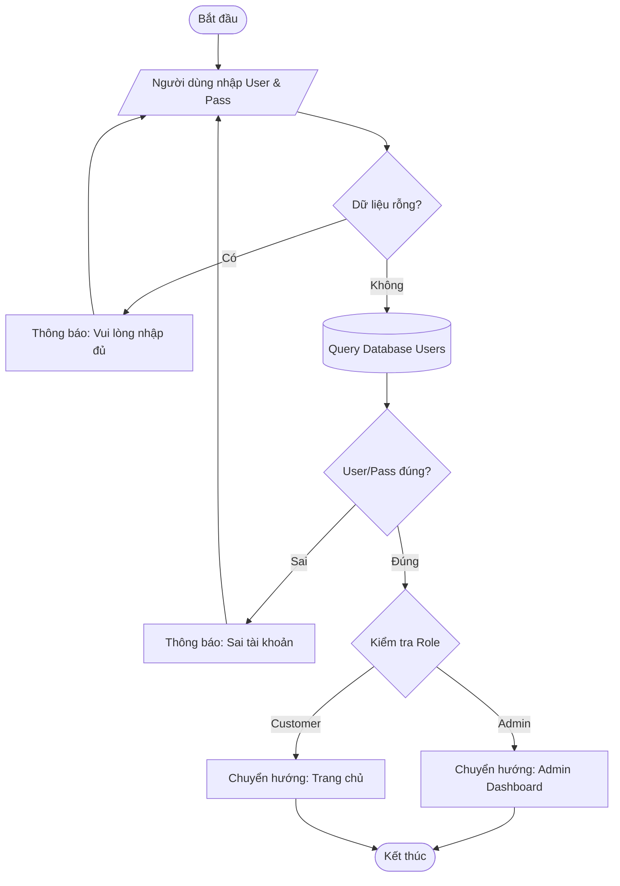
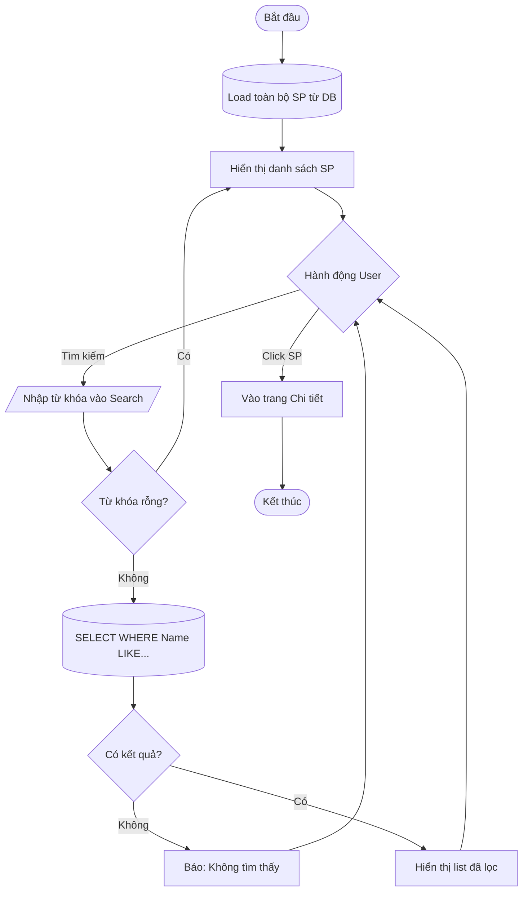
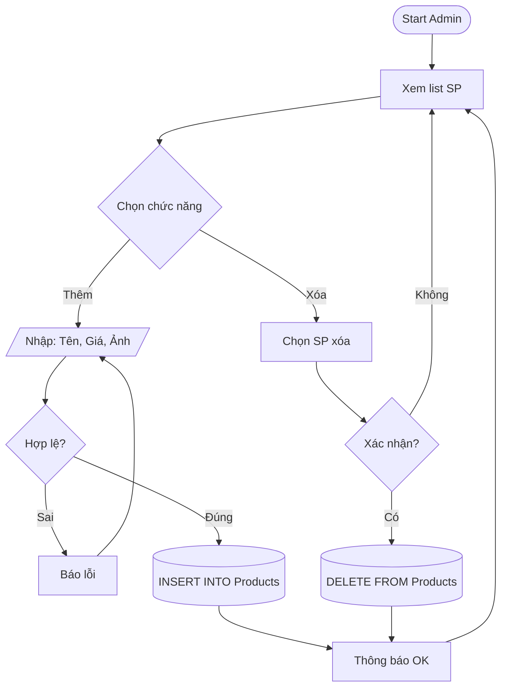

# CÁC QUY TRÌNH HỆ THỐNG (SYSTEM FLOWCHARTS)

## 1. Quy trình Đăng nhập

```mermaid
flowchart TD
    Start([Bắt đầu]) --> Input[/Người dùng nhập User & Pass/]
    Input --> CheckEmpty{Dữ liệu rỗng?}
    CheckEmpty -- Có --> Error1[Thông báo: Vui lòng nhập đủ]
    Error1 --> Input
    CheckEmpty -- Không --> QueryDB[(Query Database Users)]
    QueryDB --> CheckValid{User/Pass đúng?}
    CheckValid -- Sai --> Error2[Thông báo: Sai tài khoản]
    Error2 --> Input
    CheckValid -- Đúng --> CheckRole{Kiểm tra Role}
    CheckRole -- Admin --> RedirectAdmin[Chuyển hướng: Admin Dashboard]
    CheckRole -- Customer --> RedirectHome[Chuyển hướng: Trang chủ]
    RedirectAdmin --> End([Kết thúc])
    RedirectHome --> End
```

## 2. Quy trình Tìm kiếm

```mermaid
flowchart TD
    Start([Bắt đầu]) --> LoadAll[(Load toàn bộ SP từ DB)]
    LoadAll --> DisplayAll[Hiển thị danh sách SP]
    DisplayAll --> UserAction{Hành động User}
    UserAction -- Tìm kiếm --> InputSearch[/Nhập từ khóa vào Search/]
    InputSearch --> CheckNull{Từ khóa rỗng?}
    CheckNull -- Có --> DisplayAll
    CheckNull -- Không --> QuerySearch[(SELECT WHERE Name LIKE...)]
    QuerySearch --> CheckResult{Có kết quả?}
    CheckResult -- Không --> MsgEmpty[Báo: Không tìm thấy]
    CheckResult -- Có --> DisplayFilter[Hiển thị list đã lọc]
    MsgEmpty --> UserAction
    DisplayFilter --> UserAction
    UserAction -- Click SP --> ViewDetail[Vào trang Chi tiết]
    ViewDetail --> End([Kết thúc])
```

## 3. Quy trình Admin

```mermaid
flowchart TD
    Start([Start Admin]) --> ViewList[Xem list SP]
    ViewList --> Action{Chọn chức năng}
    Action -- Thêm --> InputInfo[/Nhập: Tên, Giá, Ảnh/]
    InputInfo --> Validate{Hợp lệ?}
    Validate -- Sai --> ErrorMsg[Báo lỗi] --> InputInfo
    Validate -- Đúng --> InsertDB[(INSERT INTO Products)]
    InsertDB --> Success[Thông báo OK]
    Action -- Xóa --> SelectItem[Chọn SP xóa]
    SelectItem --> Confirm{Xác nhận?}
    Confirm -- Không --> ViewList
    Confirm -- Có --> DeleteDB[(DELETE FROM Products)]
    DeleteDB --> Success
    Success --> ViewList
```